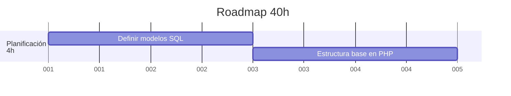

# 🛠️ Planificación y estructura básica del proyecto 4h

## 📝 Definir modelos en SQL

### 🎯 Actividades

* **Tabla `act`**: Almacena la lista de actividades disponibles en el sistema.  
  - Columnas:
    - `act_id`: Identificador único de la actividad.
    - `act_name`: Nombre de la actividad, que debe ser único.
    - `act_desc`: Descripción de la actividad.
    - `act_durat`: Tiempo estimado de duración de la actividad.

* **Tabla `obj`**: Contiene los objetivos asociados a las actividades.  
  - Columnas:
    - `obj_id`: Identificador único del objetivo.
    - `obj_name`: Nombre del objetivo, que debe ser único.
    - `obj_desc`: Descripción del objetivo.

* **Tabla `cat`**: Incluye las categorías para clasificar las actividades.  
  - Columnas:
    - `cat_id`: Identificador único de la categoría.
    - `cat_name`: Nombre de la categoría, que debe ser único.
    - `cat_desc`: Descripción detallada de la categoría.

* **Tabla `mat`**: Guarda la lista de materiales asociados a las actividades.  
  - Columnas:
    - `mat_id`: Identificador único del material.
    - `mat_name`: Nombre del material, que debe ser único.
    - `mat_desc`: Descripción del material.

* **Tablas intermedias para relaciones**:
  - **Tabla `act_obj`**: Relaciona las actividades con sus objetivos.  
    - Columnas: `act_id` y `obj_id`.  
    - Llaves foráneas: `act_id` hace referencia a la tabla `act` y `obj_id` a la tabla `obj`.
    
  - **Tabla `act_cat`**: Vincula las actividades con sus categorías.  
    - Columnas: `act_id` y `cat_id`.  
    - Llaves foráneas: `act_id` se relaciona con `act` y `cat_id` con `cat`.
    
  - **Tabla `act_mat`**: Conecta las actividades con los materiales necesarios.  
    - Columnas: `act_id` y `mat_id`.  
    - Llaves foráneas: `act_id` enlaza con `act` y `mat_id` enlaza con `mat`.

### 🗓️ Reuniones

* **Tabla `prog`**: Registra la programación de reuniones, salidas y campamentos.  
  - Columnas:
    - `prog_id`: Identificador único de la programación.
    - `prog_date`: Fecha en la que se realiza la reunión.
    - `prog_time`: Hora de inicio de la reunión.
    - `prog_coord`: Coordinador de la reunión.
    - `prog_place`: Lugar donde se realiza la reunión.
    - `prog_child_N`: Número de participantes.
    - `grp_id`: Identificador del grupo relacionado.
    - `rama_id`: Identificador de la rama asociada.
    - `responsibles`: Lista de responsables de la reunión.

* **Tabla `rama`**: Almacena la información de las ramas de los scouts.  
  - Columnas:
    - `rama_id`: Identificador único de la rama.
    - `rama_name`: Nombre de la rama.
    
* **Tabla `grps`**: Gestiona la información de los grupos de scouts.  
  - Columnas:
    - `grp_id`: Identificador único del grupo.
    - `grp_name`: Nombre del grupo.
    - `grp_address`: Dirección del grupo.
    - `grp_info`: Información adicional sobre el grupo.

* **Tabla `prog_act`**: Relaciona la programación (`prog`) con las actividades (`act`).  
  - Columnas:
    - `prog_id`: Identificador de la programación.
    - `act_id`: Identificador de la actividad.
    - `act_order`: Orden de la actividad en la programación.
    - `act_respon`: Responsable de la actividad.

### ➕ Opcionales

Se pueden incorporar tablas adicionales para gestionar, por ejemplo, los responsables de cada rama o actividad, o para administrar datos personales de los participantes siguiendo las normativas de protección de datos.

---

## 📂 Crear estructura base del proyecto en PHP

Definimos una estructura de carpetas con los siguientes módulos:
  
- `/.res`: Recursos generales del proyecto.
- `/actividades`: Módulo para la gestión de actividades.
- `/calendario`: Módulo para la visualización y administración del calendario.
- `/reuniones`: Módulo dedicado a la gestión de reuniones y programaciones.