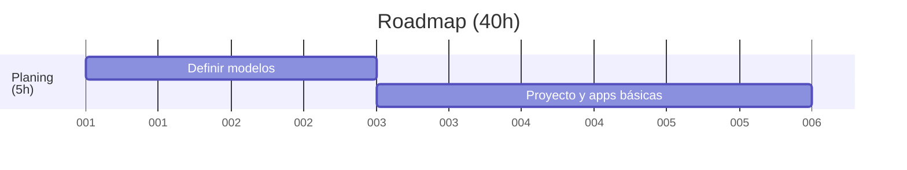

# 🛠️ Planificación y estructura básica del proyecto (4h)

## 📝 Definir modelos en Django

- Crear modelo `Actividad` con campos: nombre, tipo, objetivo pedagógico, descripción, duración.
- Crear modelo `ObjetivoPedagogico` para categorizar actividades.
- Relacionar actividades con objetivos mediante ForeignKey o ManyToMany (según necesidad).
- Modelo `Programacion`: fecha, unidad/scouts, responsable.
- Modelo `ActividadProgramada`: relación entre `Programacion` y `Actividad` + orden.
- Modelo `Reunion`: fecha, tema, descripción, actividades asociadas.

---

## 📂 Crear proyecto y apps básicas

- Crear proyecto Django: `django-admin startproject badentracker`
- Crear apps:
  - `actividades` para la gestión de actividades y objetivos.
  - `reuniones` para organizar las reuniones y programaciones.
  - `calendario` (opcional) para integraciones con eventos y fechas.
- Configurar `INSTALLED_APPS` y el admin de Django.
- Añadir modelos al admin para poder gestionarlos desde el panel.
