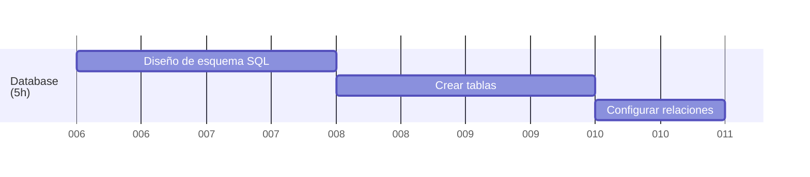
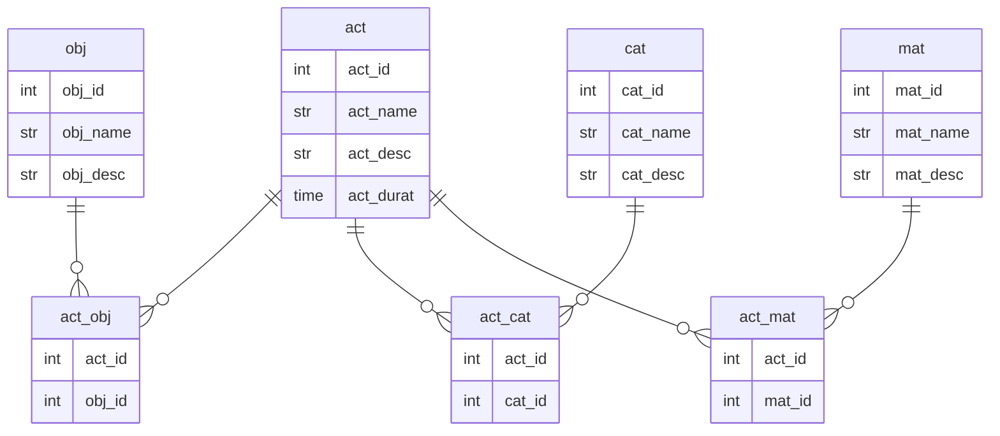
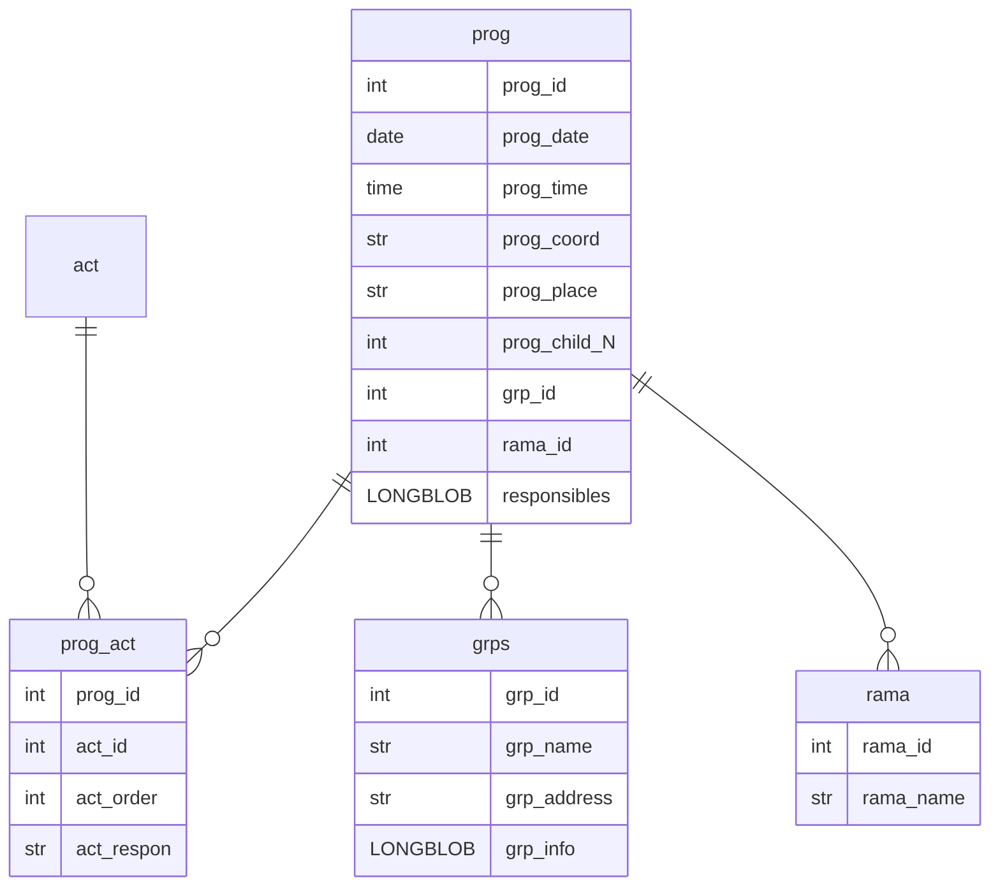

<a href="/.md/readme.md"></a>

# 🗄️ Diseño de la base de datos (5h)



## 🎯 Base de datos de Actividades<a href="../.res/db/act_tables.sql"></a>

### 📋 Esquemas de datos (Diagrama ER)



### 🛠️ Modelos de datos en SQL (Actividades)

```sql
/* Tabla de actividades */
CREATE TABLE IF NOT EXISTS act(  
    act_id      int         NOT NULL    PRIMARY KEY AUTO_INCREMENT,
    act_name    varchar(50) NOT NULL    UNIQUE,
    act_desc    varchar(255),
    act_durat   time(0)
);

/* Tabla de objetivos */
CREATE TABLE IF NOT EXISTS obj(  
    obj_id      int         NOT NULL    PRIMARY KEY AUTO_INCREMENT,
    obj_name    varchar(50) NOT NULL    UNIQUE,
    obj_desc    varchar(255)
);

/* Tabla de categorias de actividades */
CREATE TABLE IF NOT EXISTS cat(  
    cat_id      int         NOT NULL    PRIMARY KEY AUTO_INCREMENT,
    cat_name    varchar(50) NOT NULL    UNIQUE,
    cat_desc    varchar(255)
);

/* Tabla de materiales */
CREATE TABLE IF NOT EXISTS mat(  
    mat_id      int         NOT NULL    PRIMARY KEY AUTO_INCREMENT,
    mat_name    varchar(50) NOT NULL    UNIQUE,
    mat_desc    varchar(255)
);
```

### 🔗 Relaciones entre modelos (Actividades)

```sql
/* Tabla entre actividades y objetivos */
CREATE TABLE IF NOT EXISTS act_obj(
    act_id      int     NOT NULL,
    obj_id      int     NOT NULL,
    PRIMARY KEY (act_id, obj_id),
    FOREIGN KEY (act_id)    REFERENCES act(act_id)  ON DELETE CASCADE,
    FOREIGN KEY (obj_id)    REFERENCES obj(obj_id)  ON DELETE CASCADE
);

/* Tabla entre actividades y categorias */
CREATE TABLE IF NOT EXISTS act_cat(
    act_id      int     NOT NULL,
    cat_id      int     NOT NULL,
    PRIMARY KEY (act_id, cat_id),
    FOREIGN KEY (act_id)    REFERENCES act(act_id)  ON DELETE CASCADE,
    FOREIGN KEY (cat_id)    REFERENCES cat(cat_id)  ON DELETE CASCADE
);

/* Tabla entre actividades y materiales */
CREATE TABLE IF NOT EXISTS act_mat(
    act_id      int     NOT NULL,
    mat_id      int     NOT NULL,
    PRIMARY KEY (act_id, mat_id),
    FOREIGN KEY (act_id)    REFERENCES act(act_id)  ON DELETE CASCADE,
    FOREIGN KEY (mat_id)    REFERENCES mat(mat_id)  ON DELETE CASCADE
);
```

---

## 📅 Base de datos de Reuniones<a href="../.res/db/reu_tables.sql"></a>

### 📋 Esquemas de datos (Diagrama ER)



### 🛠️ Modelos de datos en SQL (Reuniones)

```sql
/* Tabla de ramas */
CREATE TABLE IF NOT EXISTS rama (
    rama_id     int         NOT NULL    PRIMARY KEY AUTO_INCREMENT,
    rama_name   varchar(50) NOT NULL
);

/* Tabla de grupos */
CREATE TABLE IF NOT EXISTS grps (
    grp_id      int         NOT NULL    PRIMARY KEY AUTO_INCREMENT,
    grp_name    varchar(50) NOT NULL,
    grp_address varchar(99) NOT NULL,
    grp_info    LONGBLOB    NOT NULL
);

/* Tabla de programaciones de reuniones */
CREATE TABLE IF NOT EXISTS prog (
    prog_id     int         NOT NULL    PRIMARY KEY AUTO_INCREMENT,
    prog_date   date        NOT NULL,
    prog_time   time        NOT NULL,
    prog_coord  varchar(50) NOT NULL,
    prog_place  varchar(50) NOT NULL,
    prog_child_N int        NOT NULL,
    grp_id      int         NOT NULL,
    rama_id     int         NOT NULL,
    responsibles LONGBLOB   NOT NULL,
    FOREIGN KEY (grp_id)    REFERENCES grps (grp_id),
    FOREIGN KEY (rama_id)   REFERENCES rama (rama_id)
);
```

### 🔗 Relaciones entre modelos (Reuniones)
``` SQL
/* Tabla entre programación y actividades */
DROP TABLE IF EXISTS prog_act;
CREATE TABLE IF NOT EXISTS prog_act(
    prog_id     int         NOT NULL,
    act_id      int         NOT NULL,
    act_order   int         NOT NULL,
    act_respon  varchar(50) NOT NULL,
    PRIMARY KEY (prog_id, act_id),
    FOREIGN KEY (prog_id)   REFERENCES prog(prog_id)    ON DELETE CASCADE,
    FOREIGN KEY (act_id)    REFERENCES act(act_id)      ON DELETE CASCADE
);
```
