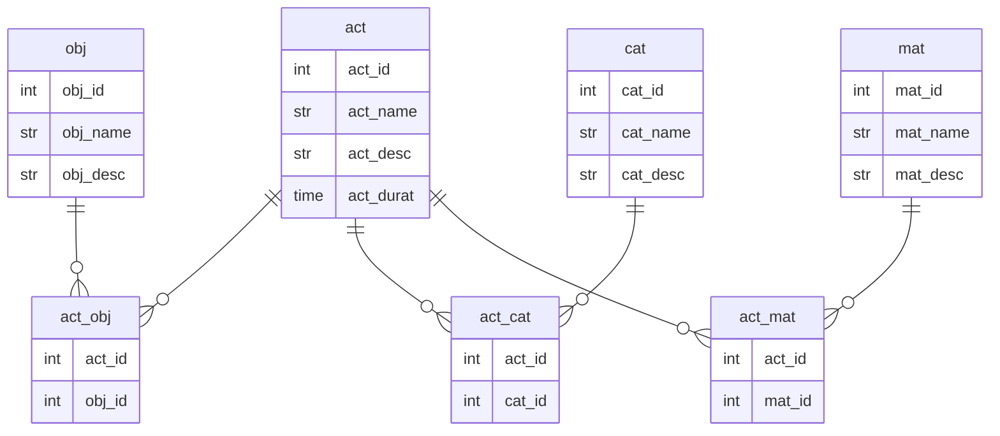
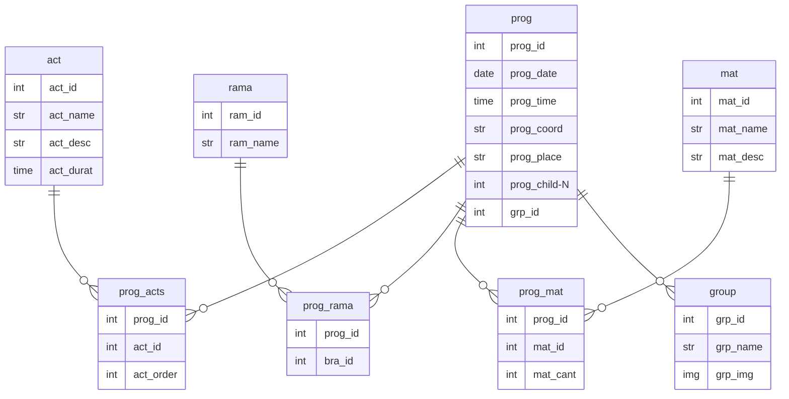

<a href="/.md/roadmap.md"></a>

# 🗄️ Diseño de la base de datos (5h)


## 📋 Definir esquemas de datos

### Base de datos de Actividades



### Base de datos de Reuniones



## 🛠️ Crear modelos de datos en Django<a href="/.res/db/act_tables.sql"></a>

```sql

/* Tabla de actividades */
DROP TABLE IF EXISTS act;

CREATE TABLE IF NOT EXISTS act(  
    act_id      int         NOT NULL PRIMARY KEY AUTO_INCREMENT COMMENT 'Primary Key',
    act_name    varchar(50) NOT NULL UNIQUE                     COMMENT 'Activity Name',
    act_desc    varchar(255)                                    COMMENT 'Activity Description',
    act_durat   time(0)                                         COMMENT 'Activity Duration'
);

/* Tabla de objetivos */
DROP TABLE IF EXISTS obj;

CREATE TABLE IF NOT EXISTS obj(  
    obj_id      int         NOT NULL PRIMARY KEY AUTO_INCREMENT COMMENT 'Primary Key',
    obj_name    varchar(50) NOT NULL UNIQUE                     COMMENT 'Objective Name',
    obj_desc    varchar(255)                                    COMMENT 'Objective Description'
);

/* Tabla de categorias de actividades */
DROP TABLE IF EXISTS cat;

CREATE TABLE IF NOT EXISTS cat(  
    cat_id      int         NOT NULL PRIMARY KEY AUTO_INCREMENT COMMENT 'Primary Key',
    cat_name    varchar(50) NOT NULL UNIQUE                     COMMENT 'Category Name',
    cat_desc    varchar(255)                                    COMMENT 'Category Description'
);

/* Tabla de materiales */
DROP TABLE IF EXISTS mat;

CREATE TABLE IF NOT EXISTS mat(  
    mat_id      int         NOT NULL PRIMARY KEY AUTO_INCREMENT COMMENT 'Primary Key',
    mat_name    varchar(50) NOT NULL UNIQUE                     COMMENT 'Material Name',
    mat_desc    varchar(255)                                    COMMENT 'Material Description'
);
```

## 🔗 Configurar relaciones entre modelos

```sql

/* Tabla entre actividades y objetivos */
DROP TABLE IF EXISTS act_obj;

CREATE TABLE IF NOT EXISTS act_obj(
    act_id      int         NOT NULL COMMENT 'Foreign Key',
    obj_id      int         NOT NULL COMMENT 'Foreign Key',
    PRIMARY KEY (act_id, obj_id),
    FOREIGN KEY (act_id) REFERENCES act(act_id) ON DELETE CASCADE,
    FOREIGN KEY (obj_id) REFERENCES obj(obj_id) ON DELETE CASCADE
);

/* Tabla entre actividades y categorias */

DROP TABLE IF EXISTS act_cat;

CREATE TABLE IF NOT EXISTS act_cat(
    act_id      int         NOT NULL COMMENT 'Foreign Key',
    cat_id      int         NOT NULL COMMENT 'Foreign Key',
    PRIMARY KEY (act_id, cat_id),
    FOREIGN KEY (act_id) REFERENCES act(act_id) ON DELETE CASCADE,
    FOREIGN KEY (cat_id) REFERENCES cat(cat_id) ON DELETE CASCADE
);

/* Tabla entre actividades y materiales */

DROP TABLE IF EXISTS act_mat;

CREATE TABLE IF NOT EXISTS act_mat(
    act_id      int         NOT NULL COMMENT 'Foreign Key',
    mat_id      int         NOT NULL COMMENT 'Foreign Key',
    PRIMARY KEY (act_id, mat_id),
    FOREIGN KEY (act_id) REFERENCES act(act_id) ON DELETE CASCADE,
    FOREIGN KEY (mat_id) REFERENCES mat(mat_id) ON DELETE CASCADE
);
```