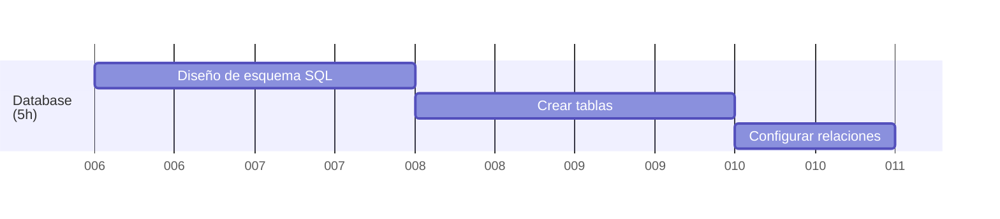
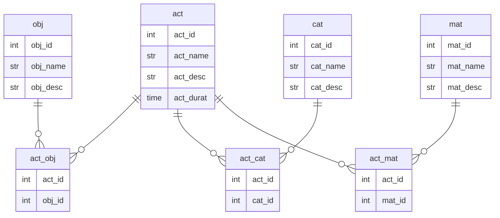
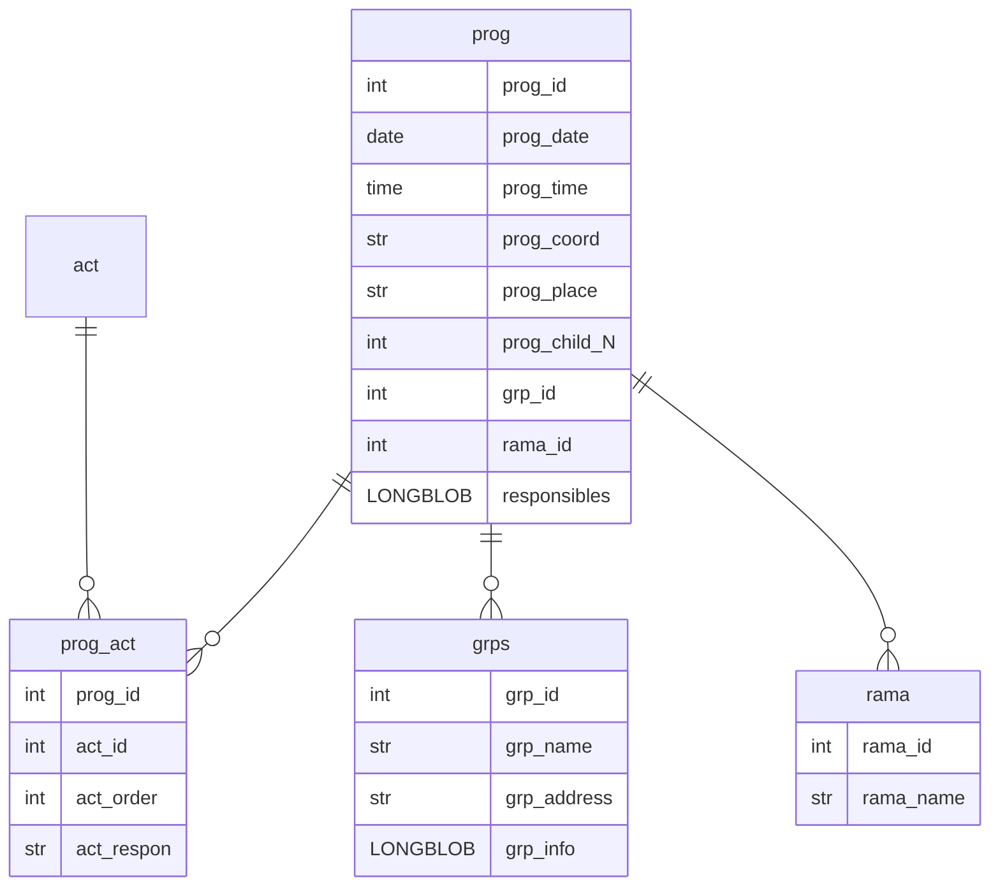

<a href="/.md/readme.md"></a>

# 🗄️ Diseño de la base de datos (5h)



## 🎯 Base de datos de Actividades

### 📋 Esquemas de datos (Diagrama ER)



### 🛠️ Modelos de datos en SQL (Actividades)

```sql
/* Tabla de actividades */
DROP TABLE IF EXISTS act;
CREATE TABLE IF NOT EXISTS act(  
    act_id      int         NOT NULL PRIMARY KEY AUTO_INCREMENT COMMENT 'Primary Key',
    act_name    varchar(50) NOT NULL UNIQUE COMMENT 'Activity Name',
    act_desc    varchar(255)            COMMENT 'Activity Description',
    act_durat   time(0)                 COMMENT 'Activity Duration'
);

/* Tabla de objetivos */
DROP TABLE IF EXISTS obj;
CREATE TABLE IF NOT EXISTS obj(  
    obj_id      int         NOT NULL PRIMARY KEY AUTO_INCREMENT COMMENT 'Primary Key',
    obj_name    varchar(50) NOT NULL UNIQUE COMMENT 'Objective Name',
    obj_desc    varchar(255)            COMMENT 'Objective Description'
);

/* Tabla de categorias */
DROP TABLE IF EXISTS cat;
CREATE TABLE IF NOT EXISTS cat(  
    cat_id      int         NOT NULL PRIMARY KEY AUTO_INCREMENT COMMENT 'Primary Key',
    cat_name    varchar(50) NOT NULL UNIQUE COMMENT 'Category Name',
    cat_desc    varchar(255)            COMMENT 'Category Description'
);

/* Tabla de materiales */
DROP TABLE IF EXISTS mat;
CREATE TABLE IF NOT EXISTS mat(  
    mat_id      int         NOT NULL PRIMARY KEY AUTO_INCREMENT COMMENT 'Primary Key',
    mat_name    varchar(50) NOT NULL UNIQUE COMMENT 'Material Name',
    mat_desc    varchar(255)            COMMENT 'Material Description'
);
```

### 🔗 Relaciones entre modelos (Actividades)

```sql
/* Tabla entre actividades y objetivos */
DROP TABLE IF EXISTS act_obj;
CREATE TABLE IF NOT EXISTS act_obj(
    act_id      int NOT NULL COMMENT 'Foreign Key',
    obj_id      int NOT NULL COMMENT 'Foreign Key',
    PRIMARY KEY (act_id, obj_id),
    FOREIGN KEY (act_id) REFERENCES act(act_id) ON DELETE CASCADE,
    FOREIGN KEY (obj_id) REFERENCES obj(obj_id) ON DELETE CASCADE
);

/* Tabla entre actividades y categorias */
DROP TABLE IF EXISTS act_cat;
CREATE TABLE IF NOT EXISTS act_cat(
    act_id      int NOT NULL COMMENT 'Foreign Key',
    cat_id      int NOT NULL COMMENT 'Foreign Key',
    PRIMARY KEY (act_id, cat_id),
    FOREIGN KEY (act_id) REFERENCES act(act_id) ON DELETE CASCADE,
    FOREIGN KEY (cat_id) REFERENCES cat(cat_id) ON DELETE CASCADE
);

/* Tabla entre actividades y materiales */
DROP TABLE IF EXISTS act_mat;
CREATE TABLE IF NOT EXISTS act_mat(
    act_id      int NOT NULL COMMENT 'Foreign Key',
    mat_id      int NOT NULL COMMENT 'Foreign Key',
    PRIMARY KEY (act_id, mat_id),
    FOREIGN KEY (act_id) REFERENCES act(act_id) ON DELETE CASCADE,
    FOREIGN KEY (mat_id) REFERENCES mat(mat_id) ON DELETE CASCADE
);
```

---

## 📅 Base de datos de Reuniones

### 📋 Esquemas de datos (Diagrama ER)



### 🛠️ Modelos de datos en SQL (Reuniones)

```sql
/* Tabla de programaciones de reuniones */
DROP TABLE IF EXISTS prog;
CREATE TABLE IF NOT EXISTS prog(
    prog_id      int         NOT NULL PRIMARY KEY AUTO_INCREMENT COMMENT 'Primary Key',
    prog_date    date        NOT NULL COMMENT 'Date of the meeting',
    prog_time    time        NOT NULL COMMENT 'Meeting start time',
    prog_coord   varchar(50) NOT NULL COMMENT 'Coordinator of the meeting',
    prog_place   varchar(50) NOT NULL COMMENT 'Place of the meeting',
    prog_child_N int         NOT NULL COMMENT 'Number of children in the meeting',
    grp_id       int         NOT NULL COMMENT 'Foreign Key to grps',
    rama_id      int         NOT NULL COMMENT 'Foreign Key to rama',
    responsibles LONGBLOB    NOT NULL COMMENT 'List of responsible persons'
);

/* Tabla de ramas */
DROP TABLE IF EXISTS rama;
CREATE TABLE IF NOT EXISTS rama(
    rama_id   int         NOT NULL PRIMARY KEY AUTO_INCREMENT COMMENT 'Primary Key',
    rama_name varchar(50) NOT NULL COMMENT 'Name of the branch'
);

/* Tabla de grupos de scouts */
DROP TABLE IF EXISTS grps;
CREATE TABLE IF NOT EXISTS grps(
    grp_id      int         NOT NULL PRIMARY KEY AUTO_INCREMENT COMMENT 'Primary Key',
    grp_name    varchar(50) NOT NULL COMMENT 'Name of the group',
    grp_address varchar(100) NOT NULL COMMENT 'Address of the group',
    grp_info    LONGBLOB    NOT NULL COMMENT 'Information about the group'
);

/* Tabla entre programación y actividades */
DROP TABLE IF EXISTS prog_act;
CREATE TABLE IF NOT EXISTS prog_act(
    prog_id    int NOT NULL COMMENT 'Foreign Key to prog',
    act_id     int NOT NULL COMMENT 'Foreign Key to act',
    act_order  int NOT NULL COMMENT 'Order of the act',
    act_respon varchar(50) NOT NULL COMMENT 'Responsible for the act',
    PRIMARY KEY (prog_id, act_id),
    FOREIGN KEY (prog_id) REFERENCES prog(prog_id) ON DELETE CASCADE,
    FOREIGN KEY (act_id) REFERENCES act(act_id) ON DELETE CASCADE
);
```

### 🔗 Relaciones entre modelos (Reuniones)

*Las relaciones en el módulo de reuniones se configuran a través de claves foráneas definidas en cada declaración SQL, garantizando la integridad referencial entre las tablas.*
