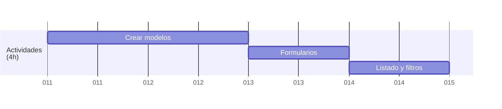

<a href="/.md/readme.md"></a>

# 🎯 CRUD de Actividades (4h)



## 🛠️ Crear modelos

> En la sección anterior de [Base de Datos](2.db.md#️-crear-modelos-de-datos-en-sql), podemos ver como se crean las diferentes tablas dentro de la base de datos.

Las tablas principales:

- Tabla `act`: para las actividades

- Tabla `obj`: para los objetivos de las actividades

- Tabla `cat`: para las categorias de actividades

- Tabla `mat`: para los materiales necesarios para la actividad

- Tabla `act_obj`: tabla entre `act` y `obj`
- Tabla `act_cat`: tabla entre `act` y `cat`
- Tabla `act_mat`: tabla entre `act` y `mat`

## 📝 Formularios

> Para los formularios tanto de añadir una nueva actividad como para editarla, he usado la siguiente estructura

```php
<form method="POST" class="form-grid">
    <input type="hidden" name="act_id" value="<?php echo $act["act_id"]; ?>">

    <!-- Nombre de la actividad -->
    <div class="form-row">
        <label for="act_name">Nombre:</label>
        <input type="text" id="act_name" name="act_name" value="<?php echo $act["act_name"]; ?>" required>
    </div>

    <!-- Duración de la actividad -->
    <div class="form-row">
        <label for="act_durat">Duración:</label>
        <input type="time" id="act_durat" name="act_durat" value="<?php echo $act["act_durat"]; ?>" required>
    </div>

    <!-- Descripción de la actividad -->
    <div class="form-row textarea-row">
        <label for="act_desc">Descripción:</label>
        <textarea id="act_desc" name="act_desc" rows="4"><?php echo $act["act_desc"]; ?></textarea>
    </div>

    <!-- Objetivos de la actividad -->
    <div class="form-row">
        <label>
            <a class="but" href="../objetivos" title="Ir a objetivos">
                Objetivos
            </a>
        </label>
        <select name="objs[]" id="objs" class="select2" multiple>
            <?php
            foreach ($allObjs as $obj) {
                $selected = "";
                foreach ($objQuery as $selectedObj) {
                    if ($selectedObj["obj_name"] === $obj["obj_name"]) {
                        $selected = "selected";
                        break;
                    }
                }
                echo "<option value='" . $obj["obj_id"] . "' $selected>" . $obj["obj_name"] . "</option>";
            }
            ?>
        </select>
    </div>

    <!-- Categorias de la actividad -->
    <div class="form-row">
        <label>
            <a class="but" href="../categorias" title="Ir a categorías">
                Categorias
            </a>
        </label>
        <select name="cat[]" id="cat" class="select2" multiple>
            <?php
            foreach ($allCats as $cat) {
                $selected = "";
                foreach ($catQuery as $selectedCat) {
                    if ($selectedCat["cat_name"] === $cat["cat_name"]) {
                        $selected = "selected";
                        break;
                    }
                }
                echo "<option value='" . $cat["cat_id"] . "' $selected>" . $cat["cat_name"] . "</option>";
            }
            ?>
        </select>
    </div>

    <!-- Materiales de la actividad -->
    <div class="form-row">
        <label>
            <a class="but" href="../materiales" title="Ir a materiales">
                Materiales
            </a>
        </label>
        <select name="mat[]" id="mat" class="select2" multiple>
            <?php
            foreach ($allMats as $mat) {
                $selected = "";
                foreach ($matQuery as $selectedMat) {
                    if ($selectedMat["mat_name"] === $mat["mat_name"]) {
                        $selected = "selected";
                        break;
                    }
                }
                echo "<option value='" . $mat["mat_id"] . "' $selected>" . $mat["mat_name"] . "</option>";
            }
            ?>
        </select>
    </div>

    <div class="form-actions">
        <button type="submit" class="btn-submit">Actualizar</button>
    </div>
</form>
```

## 🔍 Listados y filtros

> Para filtrar dentro de las tablas he utilizado el siguiente script, mediante el cual no solo busca por texto en cualquiera de las tablas, sino que tambien intercala los colores.

```js
function initSearch() {
    document.getElementById("searchInput").addEventListener("keyup", function () {
        var input = removeAccents(this.value.toLowerCase());
        var rows = document.querySelectorAll(".table-main tr");

        rows.forEach(function (row, index) {
            if (index === 0) return; // Saltar la fila de encabezados

            var text = removeAccents(row.textContent.toLowerCase());
            row.style.display = text.includes(input) ? "" : "none";
        });
    });
    document.getElementById('searchInput').addEventListener('input', function () {
        const filter = this.value.toLowerCase();
        const rows = document.querySelectorAll('.table-main tr');
        let visibleRowIndex = 0;

        rows.forEach((row, index) => {
            if (index === 0) return; // Saltar la fila de encabezado

            const text = row.textContent.toLowerCase();
            if (text.includes(filter)) {
                row.style.display = ''; // Mostrar fila
                // Aplicar colores intercalados
                const isEven = visibleRowIndex % 2 === 0;
                row.style.backgroundColor = isEven ? 'var(--color001)' : 'var(--color004)';
                row.style.color = isEven ? 'var(--color002)' : 'var(--color001)';

                // Aplicar estilos a los botones dentro de la fila
                const buttons = row.querySelectorAll('.but');
                buttons.forEach(button => {
                    button.style.color = isEven ? 'var(--color002)' : 'var(--color001)';
                    button.style.stroke = isEven ? 'var(--color002)' : 'var(--color001)';
                    button.style.borderColor = isEven ? 'var(--color002)' : 'var(--color001)';
                });

                visibleRowIndex++;
            } else {
                row.style.display = 'none'; // Ocultar fila
            }
        });
    });
}
```

> Por mi falta de conocimiento en javascript, he necesitado ayuda de la inteligencia artificial para poder realizarlo

## 🖼️ Capturas del proyecto

### 📋 Listado de actividades


### 🔍 Filtrado de actividades


### ➕ Crear actividad


### ✏️ Editar actividad


> La estructura de las tablas de objetivos, categorias y materiales, asi como de los formularios para crearlas, no distan mucho de la estructura de la tabla de actividades, por lo que tan solo se muestran las capturas de las tablas principales de estos.

### 🎯 Objetivos


### 📊 Categorias


### 📚 Materiales


