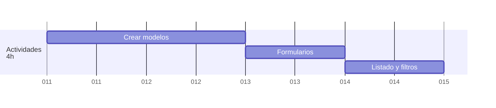
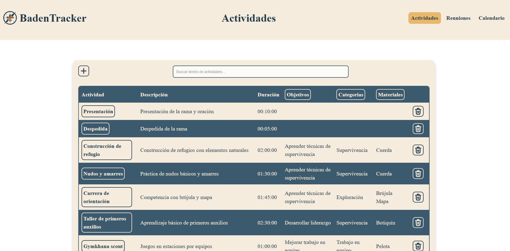
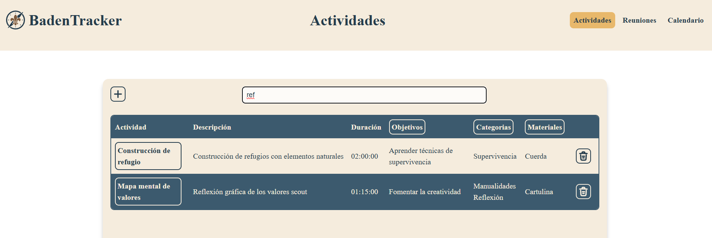
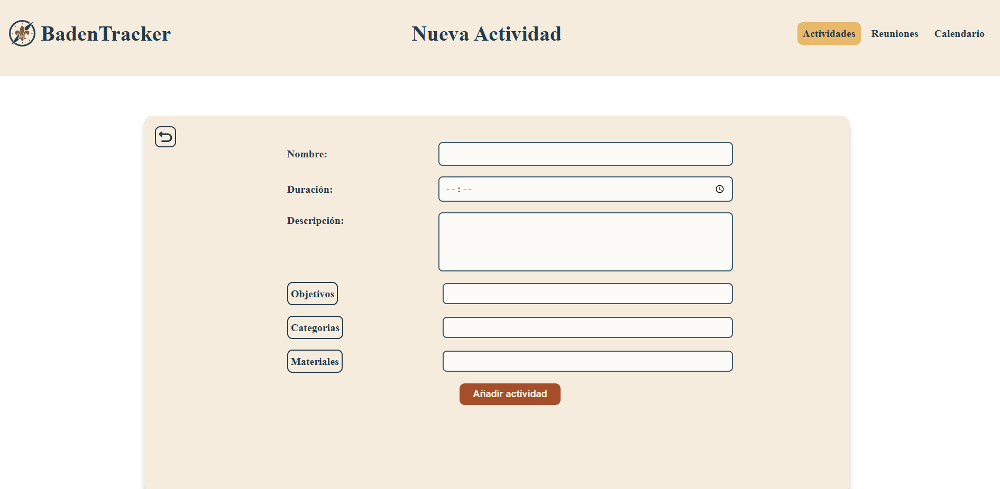
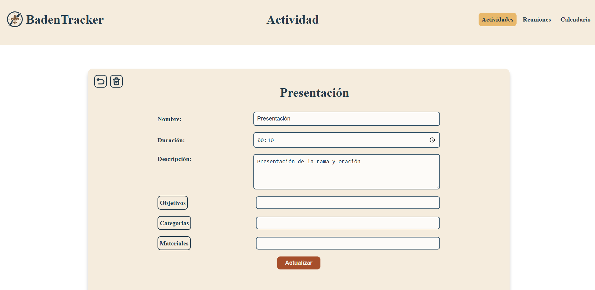
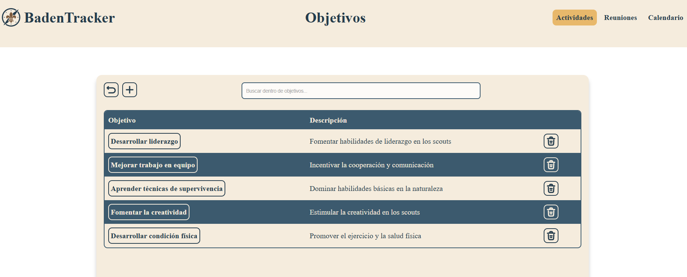
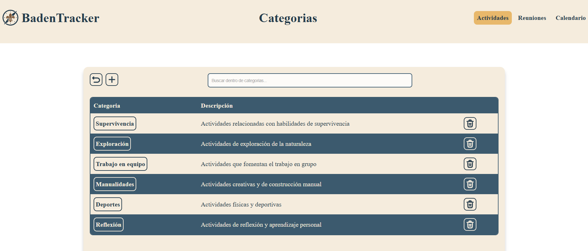
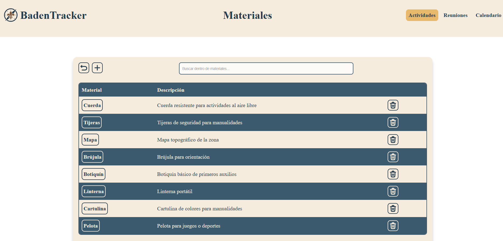

<a href="/.md/readme.md"></a>

# 🎯 CRUD de Actividades (4h)



## 🛠️ Crear modelos

> En la sección anterior de [Base de Datos](2.db.md#️-crear-modelos-de-datos-en-sql), se detallan las tablas y relaciones.

Las tablas principales:

- **act**: actividades (`act_id`, `act_name`, `act_desc`, `act_durat`)
- **obj**: objetivos (`obj_id`, `obj_name`, `obj_desc`)
- **cat**: categorías (`cat_id`, `cat_name`, `cat_desc`)
- **mat**: materiales (`mat_id`, `mat_name`, `mat_desc`)
- **act_obj**: relación actividades-objetivos
- **act_cat**: relación actividades-categorías
- **act_mat**: relación actividades-materiales

Las tablas intermedias permiten que una actividad tenga múltiples objetivos, categorías y materiales asociados.

## 📝 Formularios

> Los formularios de alta y edición de actividades usan Select2 para seleccionar múltiples objetivos, categorías y materiales. El formulario real implementado es:

```php
<form method="POST" class="form-grid">
    <input type="hidden" name="act_id" value="<?php echo $act["act_id"] ?? ''; ?>">

    <!-- Nombre de la actividad -->
    <div class="form-row">
        <label for="act_name">Nombre:</label>
        <input type="text" id="act_name" name="act_name" value="<?php echo $act["act_name"] ?? ''; ?>" required>
    </div>

    <!-- Duración de la actividad -->
    <div class="form-row">
        <label for="act_durat">Duración:</label>
        <input type="time" id="act_durat" name="act_durat" value="<?php echo $act["act_durat"] ?? ''; ?>" required>
    </div>

    <!-- Descripción de la actividad -->
    <div class="form-row textarea-row">
        <label for="act_desc">Descripción:</label>
        <textarea id="act_desc" name="act_desc" rows="4"><?php echo $act["act_desc"] ?? ''; ?></textarea>
    </div>

    <!-- Objetivos de la actividad -->
    <div class="form-row">
        <label>
            <a class="but2" href="../objetivos" title="Ir a objetivos">Objetivos</a>
        </label>
        <select name="objs[]" id="objs" class="select2" multiple>
            <?php foreach ($allObjs as $obj): ?>
                <option value="<?= $obj["obj_id"] ?>" <?= in_array($obj["obj_id"], $selectedObjs ?? []) ? 'selected' : '' ?>>
                    <?= $obj["obj_name"] ?>
                </option>
            <?php endforeach; ?>
        </select>
    </div>

    <!-- Categorías de la actividad -->
    <div class="form-row">
        <label>
            <a class="but2" href="../categorias" title="Ir a categorías">Categorías</a>
        </label>
        <select name="cat[]" id="cat" class="select2" multiple>
            <?php foreach ($allCats as $cat): ?>
                <option value="<?= $cat["cat_id"] ?>" <?= in_array($cat["cat_id"], $selectedCats ?? []) ? 'selected' : '' ?>>
                    <?= $cat["cat_name"] ?>
                </option>
            <?php endforeach; ?>
        </select>
    </div>

    <!-- Materiales de la actividad -->
    <div class="form-row">
        <label>
            <a class="but2" href="../materiales" title="Ir a materiales">Materiales</a>
        </label>
        <select name="mat[]" id="mat" class="select2" multiple>
            <?php foreach ($allMats as $mat): ?>
                <option value="<?= $mat["mat_id"] ?>" <?= in_array($mat["mat_id"], $selectedMats ?? []) ? 'selected' : '' ?>>
                    <?= $mat["mat_name"] ?>
                </option>
            <?php endforeach; ?>
        </select>
    </div>

    <div class="form-actions">
        <button type="submit" class="btn-submit">
            <?= isset($act) ? 'Actualizar' : 'Añadir actividad' ?>
        </button>
    </div>
</form>
```

> El formulario de edición y el de alta son prácticamente idénticos, solo cambian los valores precargados.

## 🔍 Listados y filtros

> El listado de actividades muestra todas las actividades junto con sus objetivos, categorías y materiales asociados. Se utiliza un input de búsqueda para filtrar dinámicamente la tabla, y se alternan los colores de las filas para mejorar la legibilidad.

```js
function initSearch() {
    document.getElementById("searchInput").addEventListener("keyup", function () {
        var input = removeAccents(this.value.toLowerCase());
        var rows = document.querySelectorAll(".table-main tr");

        rows.forEach(function (row, index) {
            if (index === 0) return; // Saltar la fila de encabezados

            var text = removeAccents(row.textContent.toLowerCase());
            row.style.display = text.includes(input) ? "" : "none";
        });
    });
    document.getElementById('searchInput').addEventListener('input', function () {
        const filter = this.value.toLowerCase();
        const rows = document.querySelectorAll('.table-main tr');
        let visibleRowIndex = 0;

        rows.forEach((row, index) => {
            if (index === 0) return; // Saltar la fila de encabezado

            const text = row.textContent.toLowerCase();
            if (text.includes(filter)) {
                row.style.display = ''; // Mostrar fila
                // Aplicar colores intercalados
                const isEven = visibleRowIndex % 2 === 0;
                row.style.backgroundColor = isEven ? 'var(--color001)' : 'var(--color004)';
                row.style.color = isEven ? 'var(--color002)' : 'var(--color001)';

                // Aplicar estilos a los botones dentro de la fila
                const buttons = row.querySelectorAll('.but');
                buttons.forEach(button => {
                    button.style.color = isEven ? 'var(--color002)' : 'var(--color001)';
                    button.style.stroke = isEven ? 'var(--color002)' : 'var(--color001)';
                    button.style.borderColor = isEven ? 'var(--color002)' : 'var(--color001)';
                });

                visibleRowIndex++;
            } else {
                row.style.display = 'none'; // Ocultar fila
            }
        });
    });
}
```

> El mismo patrón de formulario y filtrado se aplica a objetivos, categorías y materiales.

## 🖼️ Capturas del proyecto

### 📋 Listado de actividades



### 🔍 Filtrado de actividades



### ➕ Crear actividad



### ✏️ Editar actividad



> La estructura de los formularios y listados de objetivos, categorías y materiales es similar a la de actividades.

### 🎯 Objetivos



### 📊 Categorías



### 📚 Materiales



