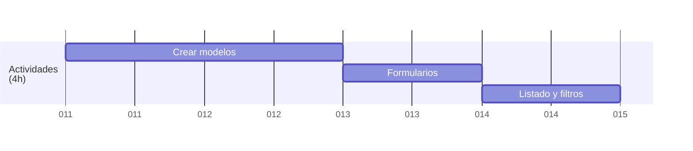

# 🎯 CRUD de Actividades (4h)

```mermaid
gantt
    dateFormat  DDD
    axisFormat %j

    section Actividades<br>(4h)
    Crear modelos               : 01-11, 2d
    Formularios                 : 01-13, 1d
    Listado y filtros           : 01-14, 1d
```

## 🛠️ Crear modelos

> Como podemos ver la anterior sección de [Base de Datos](2.db.md#️-crear-modelos-de-datos-en-sql)

## 📝 Formularios

## 🔍 Listados y filtros