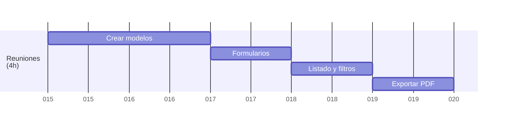
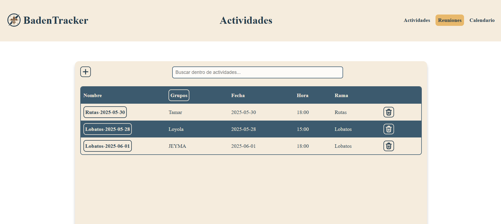
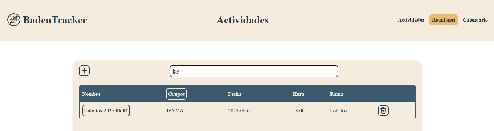
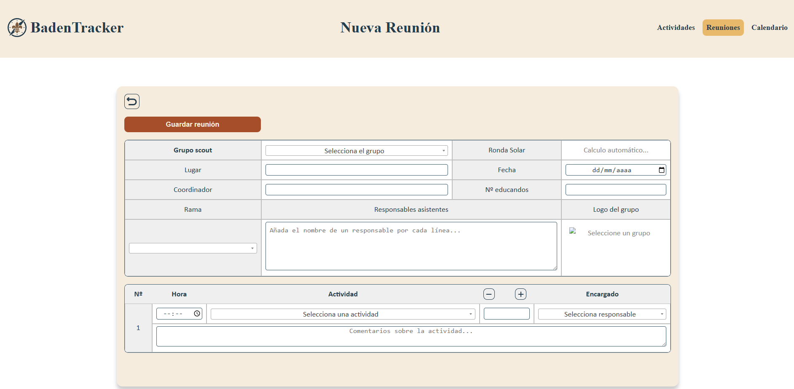
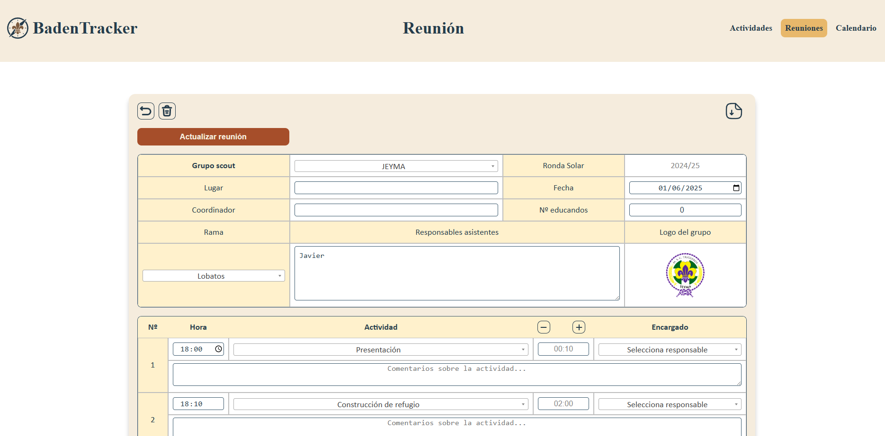
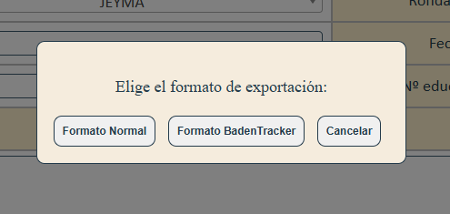

<a href="/.md/readme.md"></a>

# 📅 CRUD de Reuniones (4h)



## 🛠️ Crear modelos

> Las tablas principales para reuniones son:
>
> - **prog**: reuniones (`prog_id`, `prog_date`, `prog_time`, `prog_coord`, `prog_place`, `prog_child_N`, `grp_id`, `rama_id`, `responsibles`)
> - **prog_act**: actividades de la reunión (`prog_id`, `act_id`, `act_order`, `act_respon`, `act_comment`)
> - **grps**: grupos scouts
> - **rama**: ramas scouts
>
> Las relaciones permiten asociar una reunión a un grupo y rama, y múltiples actividades a cada reunión.

## 📝 Formularios

> El formulario de alta y edición de reuniones permite seleccionar grupo, rama, lugar, fecha, coordinador, número de educandos, responsables y añadir actividades con hora, actividad, duración, encargado y comentarios.
>
> **Campos adicionales:**
>
> - **Descripción**: Breve descripción de la reunión.
> - **Tipo de reunión**: Selección del tipo de reunión (Ej: Consejo, Actividad, Otro).
> - **Estado**: Estado de la reunión (Programada, Cancelada, Finalizada).

```php
<form method="POST" class="form-grid">
    <button type="submit" class="btn-submit" style="width: 25%;">
        <?php echo $editMode ? 'Actualizar reunión' : 'Guardar reunión'; ?>
    </button>
    <input type="hidden" name="act_id">
    <!-- Tabla de información general -->
    <table>
        <tr>
            <td class="branchCell" width="25%">
                <label for="grop_id"><b>Grupo scout</b></label>
            </td>
            <td width="35%">
                <select name="grps[]" id="grps" class="select2" required>
                    <!-- Opciones de grupos -->
                </select>
            </td>
            <td class="branchCell" width="20%">Ronda Solar</td>
            <td width="20%">
                <span id="rondaSolar" style="color:#888;">Calculo automático...</span>
            </td>
        </tr>
        <tr>
            <td class="branchCell"><label for="prog_place">Lugar</label></td>
            <td><input type="text" name="prog_place" id="prog_place"></td>
            <td class="branchCell"><label for="prog_date">Fecha</label></td>
            <td><input type="date" name="prog_date" id="prog_date" required></td>
        </tr>
        <tr>
            <td class="branchCell"><label for="prog_coord">Coordinador</label></td>
            <td><input type="text" name="prog_coord" id="prog_coord"></td>
            <td class="branchCell"><label for="prog_child_N">Nº educandos</label></td>
            <td><input type="number" name="prog_child_N" id="prog_child_N"></td>
        </tr>
        <tr>
            <td class="branchCell"><label for="rama">Rama</label></td>
            <td class="branchCell" colspan="2"><label for="responsables">Responsables asistentes</label></td>
            <td class="branchCell">Logo del grupo</td>
        </tr>
        <tr>
            <td>
                <select name="rama[]" id="rama" class="select2" required>
                    <!-- Opciones de ramas -->
                </select>
            </td>
            <td colspan="2">
                <textarea id="responsables" name="responsables" rows="2" placeholder="Añada el nombre de un responsable por cada línea..." required></textarea>
            </td>
            <td class="logoCell" style="color:#888;">
                
            </td>
        </tr>
    </table>
    <!-- Tabla de actividades -->
    <table id="actTable">
        <tr class='branchCell'>
            <th width='5%'>Nº</th>
            <th width='10%'>Hora</th>
            <th width='50%'>Actividad</th>
            <th width='10%'>Duración</th>
            <th width='25%'>Encargado</th>
        </tr>
        <!-- Filas de actividades dinámicas -->
    </table>
</form>
```

> Las actividades se agregan dinámicamente con JavaScript, permitiendo seleccionar la actividad, hora, duración (automática), encargado y comentarios.

## 🔍 Listados y filtros

> El listado de reuniones muestra todas las reuniones con su grupo, fecha, hora y rama. Incluye un input de búsqueda para filtrar dinámicamente la tabla.
>
> **Funcionalidades adicionales:**
>
> - **Paginación**: Navegar entre páginas de resultados.
> - **Ordenamiento**: Ordenar por columna (fecha, grupo, rama).
> - **Exportar**: Opción para exportar el listado a CSV.

```js
function initSearch() {
    document.getElementById("searchInput").addEventListener("keyup", function () {
        var input = removeAccents(this.value.toLowerCase());
        var rows = document.querySelectorAll(".table-main tr");

        rows.forEach(function (row, index) {
            if (index === 0) return; // Saltar la fila de encabezados

            var text = removeAccents(row.textContent.toLowerCase());
            row.style.display = text.includes(input) ? "" : "none";
        });
    });
    document.getElementById('searchInput').addEventListener('input', function () {
        const filter = this.value.toLowerCase();
        const rows = document.querySelectorAll('.table-main tr');
        let visibleRowIndex = 0;

        rows.forEach((row, index) => {
            if (index === 0) return; // Saltar la fila de encabezado

            const text = row.textContent.toLowerCase();
            if (text.includes(filter)) {
                row.style.display = '';
                // Alternar colores de fila
                const isEven = visibleRowIndex % 2 === 0;
                row.style.backgroundColor = isEven ? 'var(--color001)' : 'var(--color004)';
                row.style.color = isEven ? 'var(--color002)' : 'var(--color001)';
                visibleRowIndex++;
            } else {
                row.style.display = 'none';
            }
        });
    });
}
```

> El patrón de filtrado es similar al de actividades.

## 📝 Exportar a PDF

> Desde la vista de edición de reunión se puede exportar la reunión a PDF en dos formatos: normal y "BadenTracker". El botón abre un modal para elegir el formato y genera el PDF con toda la información de la reunión, actividades, responsables, materiales y logo del grupo.
>
> **Opciones de exportación:**
>
> - **Normal**: Formato estándar con todos los detalles de la reunión.
> - **BadenTracker**: Formato simplificado para el seguimiento de actividades.

- El PDF incluye:
  - Datos generales de la reunión (grupo, rama, fecha, lugar, coordinador, ronda solar, responsables, logo)
  - Tabla de actividades con hora, nombre, duración, encargado y comentarios
  - Tabla de materiales necesarios
  - Objetivos pedagógicos y contenidos generales

> La exportación se realiza con FPDF y el archivo [`reunion/pdfExport.php`](reunion/pdfExport.php) genera el PDF usando los datos de la base de datos.
---

## 🖼️ Capturas del proyecto

### 📋 Listado de reuniones



### 🔍 Filtrado de reuniones



### ➕ Crear reunión



### ✏️ Editar reunión



### 📄 Exportar a PDF

