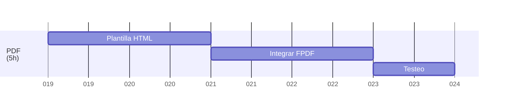

# 🖨️ Generador de PDF (5h)

## 📝 Contexto y objetivo

Antes de este proyecto, las programaciones de reuniones y actividades scouts se realizaban a mano, en hojas sueltas o documentos dispersos. Las actividades quedaban desperdigadas en programaciones anteriores, sin un orden claro, o simplemente en la memoria de los responsables. Esto dificultaba la reutilización de actividades, la consulta de materiales y objetivos, y sobre todo, la generación de nuevas programaciones.

El objetivo principal de este proyecto es centralizar toda la información de reuniones y actividades en una base de datos, permitiendo así una gestión más eficiente y ordenada. Uno de los puntos clave es facilitar la exportación de las programaciones a PDF, para que puedan ser impresas, compartidas o archivadas fácilmente.

## 🖼️ Plantilla

La exportación a PDF utiliza una plantilla utilizada para la realización de las programaciones scouts, viene dada por MSC (Movimiento Scout Católico) a nivel nacional, y la que deben usar todos los grupos de España.

Esta, recoge todos los datos relevantes de la reunión o actividad: datos generales (grupo, rama, fecha, lugar, coordinador, responsables), actividades, así como materiales utilizados.

La plantilla está diseñada para ser clara y legible, adaptándose tanto a un formato estándar como a un formato simplificado para el seguimiento en campo.

## 🛠️ Integrar FPDF y funciones de exportación

La generación de PDFs se realiza con la librería [FPDF](https://www.fpdf.org/), integrada en el archivo [`reunion/pdfExport.php`](reunion/pdfExport.php). Esta integración permite:

- Recoger todos los datos de la base de datos de manera estructurada.
- Generar el PDF en dos formatos diferentes:
  - **BadenTracker**: Incluye todos los detalles de la reunión, actividades, responsables, materiales, objetivos y logo del grupo. Es el formato recomendado para archivo y consulta detallada.
  - **Normal**: Un formato simplificado, pensado para el seguimiento de la reunión en campo. Presenta solo la información esencial y una tabla de actividades más compacta.

El usuario puede elegir el formato de exportación desde la vista de edición de reunión, donde un botón abre un modal para seleccionar el tipo de PDF a generar.

### Funciones principales de exportpdf

- **Recopilación de datos**: Se obtienen todos los datos de la reunión, actividades asociadas, responsables, materiales y objetivos desde la base de datos.
- **Generación dinámica**: El PDF se genera en tiempo real, adaptando el contenido y el diseño según el formato elegido.
- **Inclusión de logo y tablas**: El PDF incluye el logo del grupo scout, tablas de actividades y materiales, y los datos generales de la reunión.
- **Descarga directa**: El archivo PDF se descarga automáticamente o se muestra en el navegador para su impresión.

### Diferencias entre formatos de exportación

| Característica         | BadenTracker                        | Normal                  |
|------------------------|-------------------------------|-------------------------------|
| Detalle de actividades | Completo (hora, duración, encargado, comentarios) | Simplificado (solo lo esencial) |
| Objetivos y materiales | Incluidos                     | Opcional o resumido           |
| Logo del grupo         | Sí                            | Sí                            |
| Uso recomendado        | Archivo, consulta, memoria    | Seguimiento en campo          |

## ✅ Testeo

El sistema ha sido probado para asegurar que la exportación funciona correctamente con diferentes tipos de reuniones y actividades, incluyendo casos con muchas actividades, materiales o responsables. Se ha verificado la compatibilidad del PDF en distintos dispositivos y navegadores.

---

> La exportación a PDF es una de las funcionalidades más valoradas del proyecto, ya que permite transformar la información digital en un documento práctico y profesional, facilitando la labor de los responsables y mejorando la organización scout.