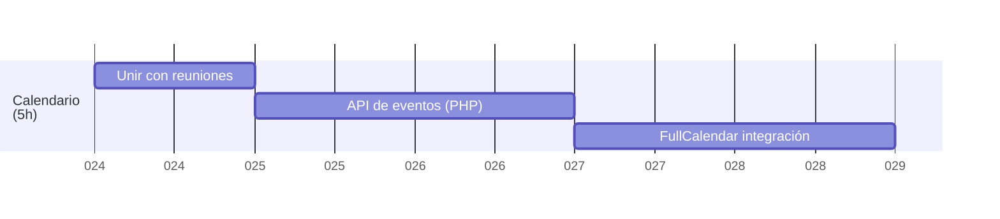

# 📆 Sistema de calendario (5h)

```mermaid
gantt
    dateFormat  DDD
    axisFormat %j
   
    section Calendario<br>(5h)
    Unir con reuniones          : 01-24, 1d
    API de eventos (PHP)        : 01-25, 2d
    FullCalendar integración    : 01-27, 2d
```

## 🔗 Unir con reuniones

## 🎉 Eventos

## 📅 Integración de calendario