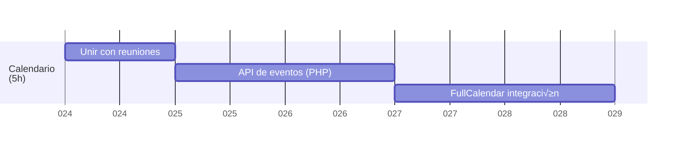
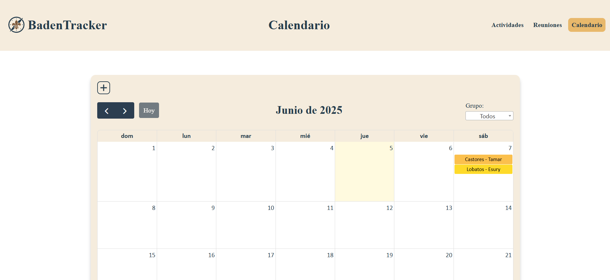

# 📆 Sistema de calendario (5h)

```mermaid
gantt
    dateFormat  DDD
    axisFormat %j
   
    section Calendario<br>(5h)
    Unir con reuniones          : 01-24, 1d
    API de eventos (PHP)        : 01-25, 2d
    FullCalendar integración    : 01-27, 2d
```

## üîó Unir con reuniones

El calendario está integrado con el módulo de reuniones. Cada evento en el calendario representa una reunión programada, y al hacer clic en un evento, se redirige a la página de detalles de la reunión correspondiente (`../reuniones/reunion?id={prog_id}`).

## üéâ Eventos

Los eventos se obtienen desde la base de datos mediante una consulta SQL que une las tablas `prog`, `grps` y `rama`. Cada evento incluye:
- **Título:** combinación de rama y grupo (`rama_name - grp_name`)
- **Fecha:** campo `prog_date`
- **Colores:** asignados seg√∫n el `rama_id` para distinguir visualmente las ramas (Castores, Lobatos, Rangers, Pioneros, Rutas)
- **URL:** enlace directo a la reunión

Ejemplo de asignación de colores:
- Naranja Castores: `#fbc04d`
- Amarillo Lobatos: `#feda2a`
- Azul Rangers: `#06abd8`
- Rojo Pioneros: `#ec2726`
- Verde Rutas: `#009d4a`
- Gris por defecto: `#757575`

## 📅 Integración de calendario

Se utiliza [FullCalendar](https://fullcalendar.io/) para mostrar los eventos en una vista mensual.  
Características principales:
- **Vista mensual** con navegación (`prev`, `next`, `today`)
- **Soporte de idioma español**
- **Filtro por grupo:** usando un `<select>` con [Select2](https://select2.org/), permite filtrar los eventos por grupo
- **Reposicionamiento del filtro:** el filtro se coloca junto al header del calendario para mejor usabilidad
- **Estilos personalizados:** los colores y el texto de los eventos se adaptan seg√∫n la rama

**Dependencias:**
- FullCalendar v6.1.11
- jQuery 3.7.1
- Select2 4.1.0-rc.0

**Archivos principales:**
- [`calendario/index.php`](../calendario/index.php): lógica PHP y frontend del calendario
- CSS personalizado: `../../.res/css/reunion.css`
- Scripts adicionales: `../.res/js/scripts.js`

## 🖼️ Capturas del proyecto

### Calendario

### Filtrado calendario

