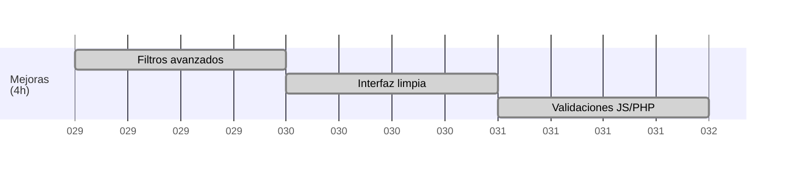

# ✨ Mejoras (4h) 🚀

En esta página se documentan las mejoras implementadas para optimizar la experiencia de usuario, la funcionalidad y la robustez del sistema. Se incluyen tanto cambios visuales como técnicos, abarcando desde la incorporación de filtros avanzados y validaciones adicionales, hasta el refinamiento del diseño y la accesibilidad. El objetivo es ofrecer una aplicación más intuitiva, eficiente y agradable para todos los usuarios.

## 🔍 Implementar filtros 

- Añadir barra de búsqueda y filtros por rama, grupo y fecha en la vista de actividades.
- Permitir filtrar actividades por estado (próximas, pasadas, todas).
- Mejorar la experiencia de usuario con filtros dinámicos (AJAX o recarga parcial).
- Mostrar el número de resultados encontrados.
- Guardar el estado de los filtros al navegar entre páginas.

## 🎨 Refinar diseño

- Unificar estilos de botones y tablas para mayor coherencia visual.
- Mejorar la visualización en dispositivos móviles (responsive).
- Ajustar los colores de las ramas para mayor contraste y accesibilidad.
- Añadir iconos representativos en acciones principales (añadir, editar, borrar).
- Revisar márgenes y espaciados para una interfaz más limpia.

## ✅ Validaciones adicionales

- Validar que todos los campos obligatorios estén completos antes de guardar.
- Comprobar que las horas de las actividades no se solapen.
- Mostrar mensajes de error claros y amigables al usuario.
- Añadir validación de formato para fechas y horas.
- Prevenir el envío de formularios duplicados por error de doble clic.
