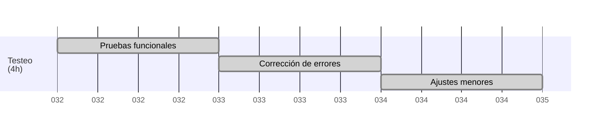

# 🧪 Tests y ajustes finales

---

## 🧪 Pruebas funcionales realizadas

En esta sección se detallan todas las pruebas realizadas para asegurar que la aplicación funciona correctamente en todos sus apartados principales. Se verificó el flujo de usuario, la integridad de los datos y la robustez ante posibles errores o usos inesperados.

- 🗺️ Verificación de rutas principales y navegación entre páginas.
- 👤 Pruebas de registro, inicio de sesión y cierre de sesión.
- 📝 Validación de formularios y mensajes de error.
- 📊 Pruebas de carga y visualización de datos en tablas/listados.
- 🔒 Comprobación de permisos de usuario y restricciones de acceso.
- 📤 Test de subida y descarga de archivos.
- 🌐 Pruebas de compatibilidad en navegadores principales (Chrome, Firefox, Edge).
- 📱💻 Revisión de funcionamiento en dispositivos móviles y escritorio.
- 🕵️‍♂️ Pruebas básicas de seguridad: intentos de acceso no autorizado y validación de sesiones.
- ⏱️ Pruebas de rendimiento en carga de páginas y operaciones frecuentes.

---

## 🛠️ Correcciones menores aplicadas

Aquí se listan los ajustes y correcciones menores que se han implementado tras el testeo, enfocados en mejorar la experiencia visual, el rendimiento y la estabilidad general del sistema.

- 🎨 Ajuste de estilos en botones y formularios para mejorar la visualización.
- ✏️ Corrección de errores tipográficos en mensajes y etiquetas.
- 📐 Solución a problemas menores de alineación en la interfaz.
- ⚡ Optimización de consultas a la base de datos para mejorar el rendimiento.
- 📦 Actualización de dependencias y librerías a versiones estables.
- ✅ Mejoras en la validación de campos obligatorios.
- 🧹 Limpieza de código y eliminación de funciones no utilizadas.
- 🕶️ Mejoras en el contraste y accesibilidad visual.

---

## 🎨 Ajustes en interfaz y lógica finalizados

En este apartado se resumen los cambios finales realizados en la interfaz y la lógica de la aplicación, con el objetivo de ofrecer una experiencia de usuario más coherente, intuitiva y profesional.

- 🌈 Unificación de paleta de colores y fuentes en toda la aplicación.
- 🧭 Simplificación de menús y navegación lateral.
- 🔔 Implementación de mensajes de confirmación y alerta.
- 🛠️ Refactorización de funciones para mayor claridad y mantenimiento.
- 🤝 Mejoras en la experiencia de usuario (UX) en formularios y listados.
- 📄 Documentación básica de uso y despliegue.