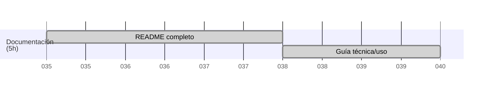

# 📚 Documentación

## Introducción

**BadenTracker** es una aplicación web para la gestión de reuniones y actividades scouts, diseñada para facilitar la organización, el seguimiento y la documentación de la programación educativa de un grupo scout. Permite registrar reuniones, actividades, materiales, objetivos y exportar toda la información en formato PDF profesional.

---

## Estructura del proyecto

El proyecto está organizado en carpetas principales:

- `/actividades`: CRUD de actividades, categorías, materiales y objetivos.
- `/reuniones`: CRUD de reuniones, grupos, ramas y exportación a PDF.
- `/calendario`: Vista de calendario de reuniones.
- `/.md`: Documentación y recursos.
- `/.res`: Recursos compartidos (css, imágenes, fpdf, funciones).

**Detalle de `/.res`:**
- `css/`: Hojas de estilo (por ejemplo, `styles.css`, `reunion.css`).
- `db/`: Scripts SQL para la base de datos.
- `fpdf/`: Librería y documentación para generación de PDFs.
- `funct/`: Funciones PHP reutilizables (por ejemplo, conexión a base de datos).
- `icon/` e `img/`: Imágenes e iconos usados en la interfaz.
- `js/`: Scripts JavaScript para la interacción de la interfaz.
- `templates/`: Fragmentos PHP reutilizables (cabecera, pie, etc).

---

## Instalación y requisitos

1. **Requisitos**:
   - PHP 7.4+ y MySQL/MariaDB.
   - Servidor web con soporte PHP (por ejemplo, Apache o Nginx).
   - Extensión `mysqli` habilitada.

2. **Instalación**:
   - Clona o descarga el repositorio en la carpeta pública de tu servidor web (por ejemplo, `/var/www/html` en Linux).
   - Accede a tu gestor de bases de datos (por ejemplo, usando `mysql` o phpMyAdmin) y crea la base de datos llamada `badentracker` y crea las bases de datos definidas en [act_tables.sql](../.res/db/act_tables.sql) y [reu_tables.sql](../.res/db/reu_tables.sql).
   - Importa el archivo SQL de estructura y datos iniciales desde `/.res/db/badentracker.sql`.
   - Configura los datos de acceso a la base de datos en `/.res/funct/funct.php` según tu entorno (usuario, contraseña, host).
   - Accede desde tu navegador a la URL correspondiente (por ejemplo, `http://localhost/badentracker` o la IP de tu servidor Apache/Nginx).

---

## Guía de uso

1. **Gestión de grupos**: Crea y edita los grupos scouts desde el menú de reuniones.
2. **Actividades**: Añade actividades, asigna categorías, materiales y objetivos pedagógicos.
3. **Reuniones**: Programa reuniones, selecciona grupo, rama, fecha, lugar, responsables y añade actividades.
4. **Exportación a PDF**: Desde la vista de edición de reunión, exporta la programación en formato estándar o BadenTracker.
5. **Calendario**: Visualiza todas las reuniones programadas en formato calendario.

---

## Funcionalidades principales

- CRUD completo de actividades, materiales, categorías y objetivos.
- CRUD de reuniones, grupos y ramas.
- Selección dinámica de responsables y actividades en formularios.
- Exportación de reuniones a PDF con plantilla oficial MSC.
- Listados y filtros avanzados.
- Interfaz moderna.
- Cambio dinámico de logos de grupo en formularios (ver función `changeLogo` en [`/.res/js/scripts.js`](../.res/js/scripts.js)).
- Cambio de color de la programación según la rama seleccionada (ver función `colorCells` en [`/.res/js/scripts.js`](../.res/js/scripts.js)).
- Cálculo automático de la ronda solar al seleccionar la fecha de la reunión (ver función `calculateSolarRound` en [`/.res/js/scripts.js`](../.res/js/scripts.js)).

---

## Exportación a PDF

La exportación a PDF se realiza desde la vista de edición de reunión. Permite elegir entre dos formatos:

- **Formato estándar**: Incluye todos los detalles de la reunión, actividades, responsables, materiales, objetivos y logo del grupo.
- **Formato BadenTracker**: Más compacto, pensado para el seguimiento en campo.

La generación de PDFs utiliza la librería [FPDF](https://www.fpdf.org/) incluida en [`/.res/fpdf/fpdf.php`](../.res/fpdf/fpdf.php) y la plantilla oficial del MSC de Huelva incuyendo logos.

---

## Modelos de datos

Tablas principales:

- **prog**: reuniones (`prog_id`, `prog_date`, `prog_time`, `prog_coord`, `prog_place`, `prog_child_N`, `grp_id`, `rama_id`, `responsibles`)
- **prog_act**: actividades de la reunión (`prog_id`, `act_id`, `act_order`, `act_respon`, `act_comment`, `act_durat`)
- **grps**: grupos scouts
- **rama**: ramas scouts
- **act**: actividades
- **cat**: categorías
- **mat**: materiales
- **obj**: objetivos

Consulta los scripts SQL en [`/.res/db/`](../.res/db/) para la estructura completa.

---

## Capturas de pantalla

### Listado de reuniones

### Filtrado de reuniones

### Crear reunión

### Editar reunión

### Exportar a PDF

---

## Créditos

Desarrollado por [covija97](https://github.com/covija97) y colaboradores.  
Documentación y soporte técnico asistidos por [GitHub Copilot](https://github.com/features/copilot) y ChatGPT de OpenAI.  
Inspiración y recursos de [FPDF](https://www.fpdf.org/), [FullCalendar](https://fullcalendar.io/), [Stack Overflow](https://stackoverflow.com/), [MDN Web Docs](https://developer.mozilla.org/).  
Plantilla PDF basada en el modelo oficial del Movimiento Scout Católico (MSC).

Agradecimientos especiales a mis compañeros Antonio Villegas, David Faustino, Victor Mena.

Y sobre todo, gracias a los profesores por su dedicación, paciencia y apoyo constante durante estos dos años. Su entrega, profesionalidad y cercanía han hecho que el aprendizaje sea una experiencia enriquecedora y motivadora, ayudándonos a crecer tanto a nivel académico como personal.