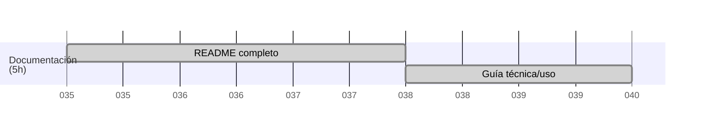

<a href="/.md/readme.md"></a>

# 📚 Documentación

## Índice

- [📚 Documentación](#-documentación)
  - [Índice](#índice)
  - [Introducción](#introducción)
  - [Instalación](#instalación)
  - [Estructura del Proyecto](#estructura-del-proyecto)
  - [Uso](#uso)
  - [Tecnologías Utilizadas](#tecnologías-utilizadas)
  - [Contribución](#contribución)
  - [Licencia](#licencia)

---

## Introducción

**Badentracker** es una aplicación desarrollada para el seguimiento y gestión de incidencias, tareas o recursos. Este documento proporciona una guía técnica y de uso para facilitar la instalación, configuración y operación del sistema.

---

## Instalación

1. **Requisitos previos:**
   - PHP >= 7.4
   - MySQL/MariaDB
   - XAMPP (recomendado para entorno local)
   - Composer (si se usa algún framework PHP)

2. **Pasos:**
   - Clona o descarga este repositorio en tu carpeta `htdocs` de XAMPP:
     ```bash
     git clone https://github.com/tuusuario/badentracker.git
     ```
   - Crea una base de datos en MySQL llamada `badentracker`.
   - Importa el archivo de estructura y datos iniciales si existe (`/database/badentracker.sql`).
   - Configura los parámetros de conexión a la base de datos en el archivo de configuración (`config.php` o `.env`).
   - Inicia Apache y MySQL desde el panel de XAMPP.
   - Accede a `http://localhost/badentracker` desde tu navegador.

---

## Estructura del Proyecto

```
badentracker/
│
├── .md/                # Documentación y recursos
├── assets/             # Imágenes, CSS, JS
├── database/           # Scripts SQL
├── includes/           # Archivos PHP reutilizables
├── index.php           # Entrada principal
├── config.php          # Configuración
└── ...
```

---

## Uso

- **Inicio de sesión:** Accede con tus credenciales proporcionadas.
- **Panel principal:** Visualiza el resumen de incidencias, tareas o recursos.
- **Gestión:** Crea, edita o elimina registros según tus permisos.
- **Reportes:** Genera reportes en PDF o Excel desde el menú correspondiente.

---

## Tecnologías Utilizadas

- PHP
- MySQL/MariaDB
- HTML5, CSS3, JavaScript
- Bootstrap (opcional)
- XAMPP

---

## Contribución

1. Haz un fork del repositorio.
2. Crea una rama para tu funcionalidad (`git checkout -b feature/nueva-funcionalidad`).
3. Realiza tus cambios y haz commit (`git commit -am 'Agrega nueva funcionalidad'`).
4. Haz push a tu rama (`git push origin feature/nueva-funcionalidad`).
5. Abre un Pull Request.

---

## Licencia

Este proyecto está bajo la licencia MIT. Consulta el archivo `LICENSE` para más detalles.

---

