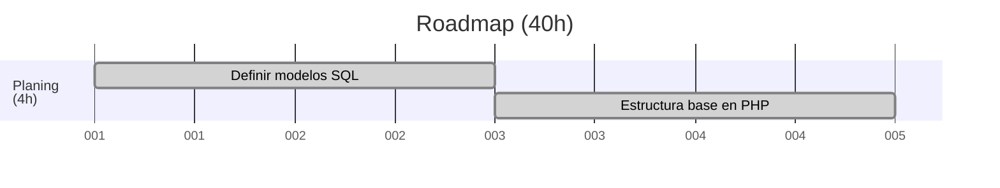
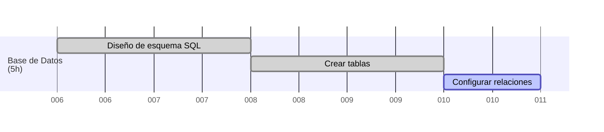
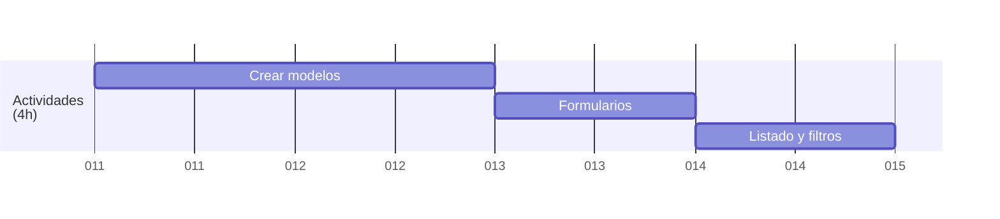
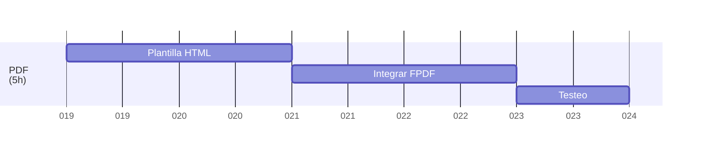
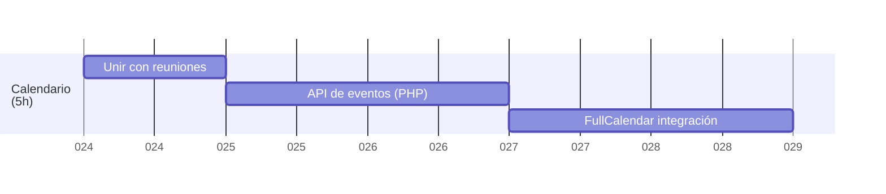
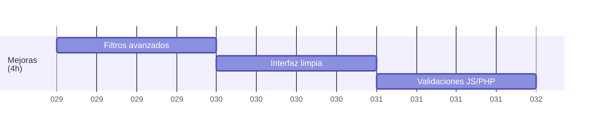
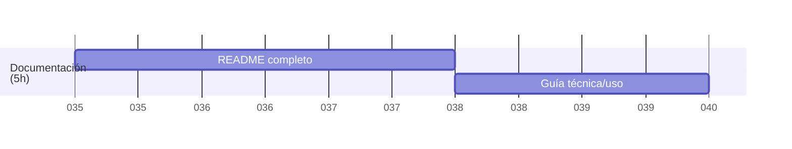

# 🗺️ Roadmap (40h) – Marzo y Mayo 2025

## 🖥 Creación y configuración del servidor

## 🛠️ Planificación y estructura básica del proyecto (4h)
- Crear estructura base con PHP (carpetas, conexión DB)

## 🗄️ Diseño de la base de datos (5h)

- Crear esquema SQL (ERD)
- Crear tablas con migraciones/manual
- Configurar relaciones (FKs, índices)

## 🎯 CRUD de Actividades (4h)

- Crear modelos `Actividad`, `Objetivos`, `Categorias` y `Materiales`
- Formularios
- Listado y filtrado

## 📅 CRUD de Reuniones (4h)
- Modelo `Programacion` + `ActividadProgramada`
- Formularios
- Listado y filtrado

## 🖨️ Generador de PDF (5h)
- Plantilla HTML para PDF
- Integrar librería como `FPDF` o `Dompdf`
- Botón de descarga en vista de programación

## 📆 Sistema de calendario (5h)

- Tabla `reuniones`
- API de eventos en PHP (formato JSON)
- Integrar `FullCalendar` en frontend

## ✨ Mejoras (4h)

- Filtros múltiples en consultas SQL
- Mejora de diseño (CSS limpio)
- Validaciones con JS y PHP

## 🧪 Tests y ajustes finales (4h)

- Pruebas funcionales (manuales)
- Correcciones menores
- Ajustes en interfaz y lógica

## 📚 Documentación (5h)

- README con instrucciones de instalación
- Documentación técnica y de uso

