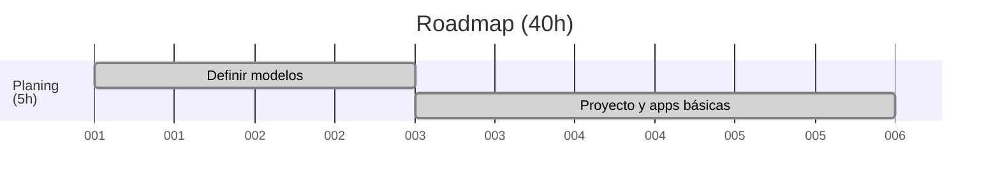
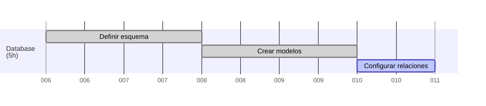
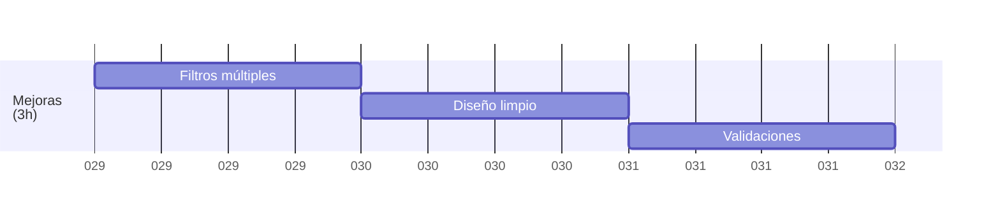
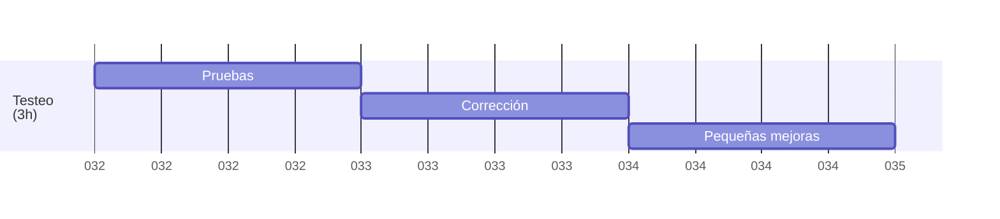
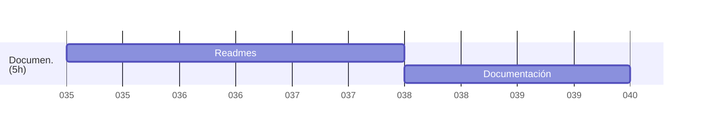

<a href="/README.md"></a>

# 🗺️ Roadmap (40h) – Marzo y Mayo 2025

## 🛠️ Planificación y estructura básica del proyecto (4h)<a href="1.planing.md"></a>
- Definir modelos en Django
- Crear proyecto y apps básicas



## 🗄️ Diseño de la base de datos (5h)<a href="2.database.md"></a>
- Definir esquemas de datos
- Crear modelos de datos en Django
- Configurar relaciones entre modelos



## 📝 CRUD de Actividades (4h)
- Crear modelos `Actividad` y `ObjetivoPedagogico`
- Formularios
- Listado y filtrado

```mermaid
gantt
    dateFormat  DDD
    axisFormat %j

    section Actividades<br>(5h)
    Crear modelos               : 01-11, 2d
    Formularios                 : 01-13, 1d
    Listado y filtrado          : 01-14, 1d
 ```

## 📅 CRUD de Reuniones (4h)
- Modelo `Programacion` + `ActividadProgramada`
- Formularios
- Listado y filtrado

```mermaid
gantt
    dateFormat  DDD
    axisFormat %j
   
    section Reuniones<br>(5h)
    Crear modelos               : 01-15, 2d
    Formularios                 : 01-17, 1d
    Listado y filtrado          : 01-18, 1d
```

## 🖨️ Generador de PDF (5h)
- Plantilla HTML para PDF
- Integrar `WeasyPrint`
- Botón de descarga en vista de programación

```mermaid
gantt
    dateFormat  DDD
    axisFormat %j

    section PDF<br>(5h)
    Plantilla PDF               : 01-19, 2d
    WeasyPrint                  : 01-21, 2d
    Testeo                      : 01-23, 1d
 ```

## 📆 Sistema de calendario (5h)
- Modelo `Reunion`
- API para eventos
- Integrar `FullCalendar` en frontend

```mermaid
gantt
    dateFormat  DDD
    axisFormat %j
   
    section Calendario<br>(5h)
    Crear modelos               : 01-24, 1d
    Eventos                     : 01-25, 2d
    FullCalendar                : 01-27, 2d
```

## ✨ Mejoras (4h)
- Filtros múltiples
- Diseño limpio de interfaces
- Validaciones



## 🧪 Tests y ajustes finales (4h)
- Pruebas básicas
- Corrección de errores
- Pequeñas mejoras



## 📚 Documentación (5h)
- README completo
- Documentación


