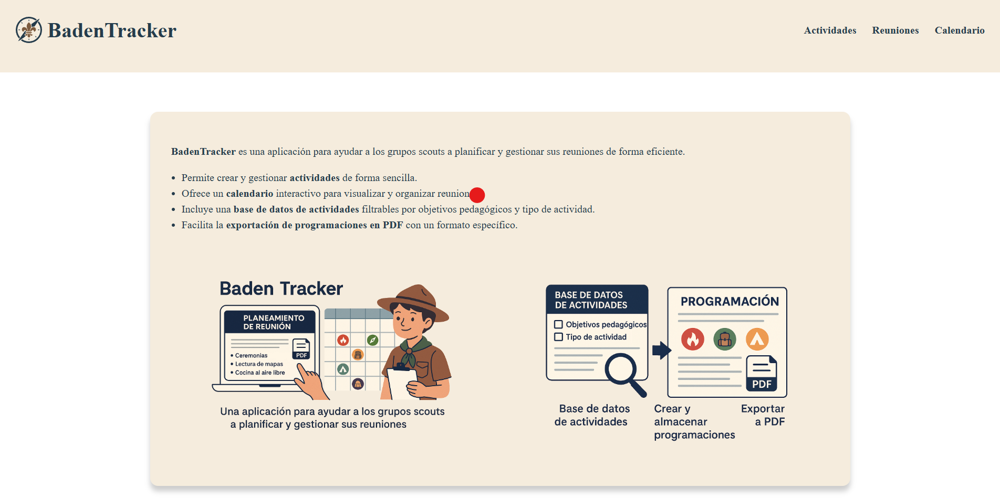

---

Author: `Javier Coronel Vides`

Course: `2º ASIR`

Subject: `Trabajo fin de Grado Superior`

---

# 🧭 BadenTracker

**BadenTracker** es una plataforma web desarrollada para facilitar la planificación, organización y gestión de reuniones dentro de un grupo scout. Su objetivo principal es brindar una herramienta intuitiva y funcional para monitores, jefes de unidad o responsables de rama, ayudando a estructurar y visualizar el trabajo pedagógico a lo largo del ciclo scout.



## 🗺️ Roadmap<a href="/.md/roadmap.md"></a>

## 🚀 Características principales

- 📄 **Creación y descarga de programaciones en PDF**  
  Genera planificaciones de reuniones con un formato predefinido que incluye encabezado, actividades ordenadas, objetivos pedagógicos y tiempos estimados.

- 🗂️ **Base de datos de actividades**  
  Almacena, clasifica y filtra actividades según criterios como tipo (juego, dinámica, reflexión...) y objetivos pedagógicos (trabajo en equipo, liderazgo, etc.).

- 📆 **Calendario de reuniones**  
  Visualiza y organiza las reuniones en un calendario interactivo. Accede rápidamente a las programaciones asociadas a cada fecha.

- 👥 **Enfoque pedagógico personalizado**  
  Las actividades están orientadas a cumplir con los objetivos formativos del escultismo, adaptándose a distintas edades y ramas.

## 🛠️ Tecnologías utilizadas

- **Backend:** PHP 8.x
- **Frontend:** HTML, CSS, JavaScript
- **Base de datos:** MySQL
- **Servidor web:** Apache / Xampp
- **Generador de PDF:** (Pendiente de instalación)
- **Integración de calendario:** (Pediente de instalación)

## 📚 Estructura del proyecto

La estructura del proyecto se dividirá en 3 grandes módulos:

* Actividades: el cual gestionará las actividades, objetivos, categorias y materiales almacenados en la base de datos.
* Calendario: el cual mostrará un calendario interactivo con las diferentes programaciones de cada día, pudiendo filtrar por rama para un manejo más cómodo.
* Reuniones: 

```
badentracker/
├── index.php               # Página de inicio
├── .res/                   # Recursos comunes
│   ├── css/                # Archivos CSS
│   ├── db/                 # Archivos de consultas y creación de tablas
│   ├── funct/              # Funciones php generales de todas las páginas
│   ├── icon/               # Iconos SVG
│   ├── img/                # Imágenes
│   ├── js/                 # Archivos JavaScript
│   └── templates/          # Plantillas HTML
│
├── actividades/            # Página de actividades
│   │
│   ├── index.php
│   │
│   ├── new/                # Página de creación de actividades
│   │   └── index.php
│   │
│   ├── actividad/          # Página de edición de actividad por ID
│   │   ├── index.php
│   │   └── delete.php
│   │
│   ├── categorias/         # Página de categorías de actividades
│   │   ├── index.php
│   │   │── categoria/      # Página de edición de categoría por ID
│   │   │   ├── index.php
│   │   │   └── delete.php
│   │   └── new/            # Página de creación de categoría
│   │       └── index.php
│   │
│   ├── materiales/         # Página de materiales de actividades
│   │   ├── index.php
│   │   │── material/       # Página de edición de material por ID
│   │   │   ├── index.php
│   │   │   └── delete.php
│   │   └── new/            # Página de creación de material
│   │       └── index.php
│   │
│   └── objetivos/          # Página de materiales de objetivos
│       ├── index.php
│       │── objetivo/       # Página de edición de objetivo por ID
│       │   ├── index.php
│       │   └── delete.php
│       └── new/            # Página de creación de objetivo
│           └── index.php
│
├── calendario/             # Página de calendario
│
└── reuniones/              # Página de reuniones

```

## 📌 Próximas mejoras

- Soporte multiusuario por unidades o ramas.
- Seguimiento de progreso personal de cada niño.
- Exportación a Google Calendar.
- Búsqueda avanzada con múltiples filtros.
- Modo offline (PWA).
- Interfaz responsive para móviles.

## 🧑‍💻 Contribución

Este proyecto está en desarrollo. Si tienes ideas, sugerencias o quieres colaborar, ¡eres más que bienvenido! Puedes abrir un issue o hacer un fork para aportar.
